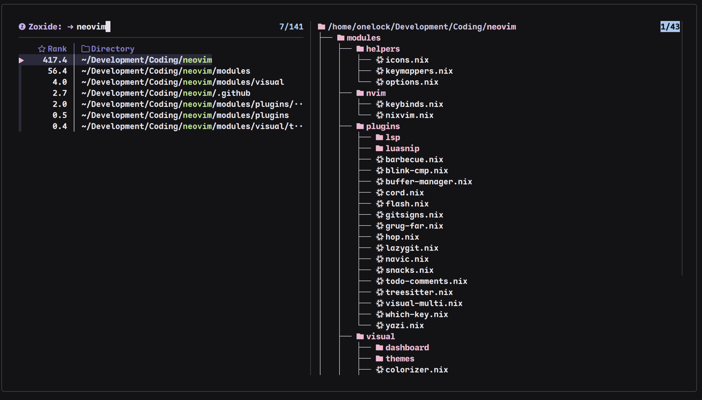

<div align="center">

# fzf-search.yazi
<br>

## Demo
<br>

**Find Files**


<br>
<br>

**Ripgrep Search**
<br>

<br>

**Zoxide**
<br>

<br>
</div>

# Requirements
```bash
eza # for directory tree
bat # for pretty preview
fzf # for fuzzy finding
zoxide # optional
```

# Installation

**Add fuzzy-search.yazi as a flake input**
```nix
# In your flake.nix
inputs.fuzzy-search-yazi = {
    url = "github:onelocked/fuzzy-search.yazi";
    inputs.nixpkgs.follows = "nixpkgs";
  }
```

**Home-Manager Module**
```nix
# In your yazi config
imports = [ inputs.fuzzy-search-yazi.homeManagerModules.default ];
programs.yazi
    fuzzy-search = {
      enable = true; # enables the plugin
      enableFishIntegration = true;  # Enables the Fish function for Zoxide Shift + Z
      depth = 3; # eza tree depth control default is =TL=3
      keymaps = {  # sets default keybinds see below
        fd = true;
        rg = true;
        zoxide = true;
      };
    };
```

**Manually Customising keybinds**
```nix
# Setting keymaps in home manager module sets these keymaps by default
# but you can manually specify the keybins you want
programs.yazi.keymap = {
     mgr.prepend_keymap = [
       {
         on = [ "z" ];
         run = "plugin fuzzy-search -- fd --TL=3";
         desc = "Fuzzy Find Files";
       }
       {
         on = [ "<S-s>" ];
         run = "plugin fuzzy-search -- rg --TL=3";
         desc = "Ripgrep Search";
       }
       {
         on = [ "<S-z>" ];
         run = "plugin fuzzy-search -- zoxide --TL=3";
         desc = "Zoxide Search";
       }
  ];
};

```

**Manually adding the plugin**
```nix
# In your yazi config
programs.yazi.plugins = {
fuzzy-search = inputs.fuzzy-search.yazi.packages.${pkgs.stdenv.hostPlatform.system}.default;
};
```
